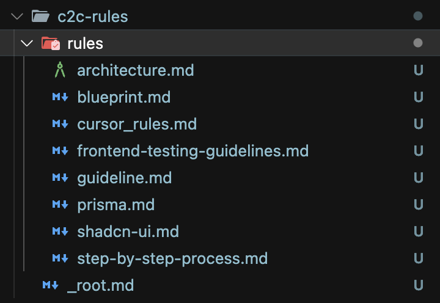
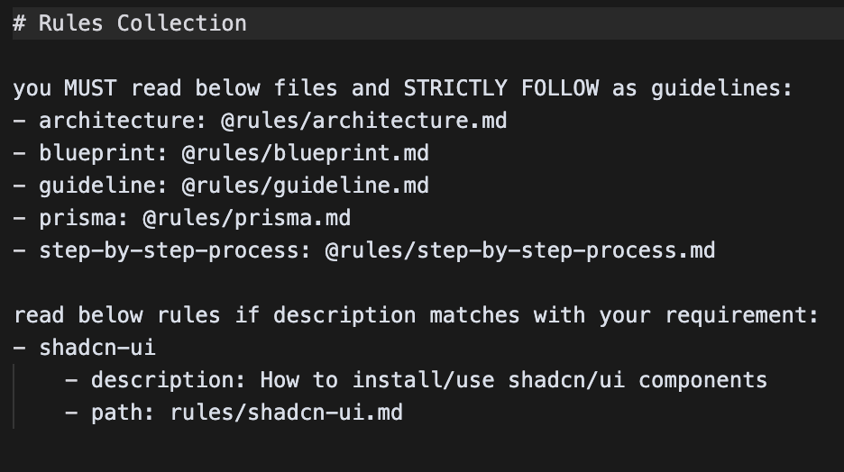

# C2C - Cursor to Claude Code

Convert Cursor IDE rules (`.mdc` files) to Claude AI markdown format with intelligent metadata parsing and categorization.

## Demo

> **Note**: If the video doesn't play, download `assets/demo.mp4` to view the demonstration.

https://github.com/user-attachments/assets/demo.mp4

## Installation

```bash
npx @vooster/c2c
```

## Features

- 🔍 **Automatic Discovery**: Recursively finds all `.cursor` directories in your project
- 📝 **Metadata Parsing**: Extracts YAML frontmatter (alwaysApply, description, globs) from `.mdc` files
- 🗂️ **Smart Categorization**: Organizes rules by priority (always apply → description → globs)
- 📁 **Separate Directories**: Creates `c2c-rules` directories next to each `.cursor` directory
- 🔗 **Auto-linking**: Generates `_root.md` index files with proper relative paths
- 📄 **CLAUDE.md Integration**: Automatically updates or creates CLAUDE.md with `<c2c-rules>` sections

## Usage

Run the command in any directory containing `.cursor` folders:

```bash
npx @vooster/c2c
```

The tool will:

1. Recursively find all `.cursor` directories in your project tree
2. Locate all `*.mdc` files within them (including nested subdirectories)
3. Parse YAML metadata from each file's frontmatter
4. Create `c2c-rules` directories next to each `.cursor` directory
5. Convert files to markdown format (stripping metadata)
6. Generate `_root.md` index files with categorized references
7. Update or create `CLAUDE.md` files with proper rule references

### Result Screenshots

**Found Files:**


**Generated Content:**


## Example

Given this structure with metadata:

```
project/
├── .cursor/
│   └── global.mdc (with alwaysApply: true)
├── frontend/
│   └── .cursor/
│       ├── rules.mdc (with description: "React component guidelines")
│       └── components/
│           └── ui-rules.mdc (with globs: "**/*.tsx")
└── backend/
    └── .cursor/
        └── api/
            └── guidelines.mdc (with globs: "**/api/**")
```

Running `npx @vooster/c2c` will create:

```
project/
├── CLAUDE.md (updated with <c2c-rules> section)
├── c2c-rules/
│   ├── _root.md
│   └── global.md
├── frontend/
│   ├── CLAUDE.md (updated with <c2c-rules> section)
│   └── c2c-rules/
│       ├── _root.md
│       ├── rules.md
│       └── components/
│           └── ui-rules.md
└── backend/
    ├── CLAUDE.md (updated with <c2c-rules> section)
    └── c2c-rules/
        ├── _root.md
        └── api/
            └── guidelines.md
```

Each `_root.md` will contain categorized rules, for example in `frontend/c2c-rules/_root.md`:

```markdown
# Rules Collection

read below rules if description matches with your requirement:

- rules
  - description: React component guidelines
  - path: rules.md

read below rules if glob pattern matches with requirement related files:

- ui-rules
  - glob: \*_/_.tsx
  - path: components/ui-rules.md
```

Each `CLAUDE.md` will be updated with:

```markdown
<c2c-rules>
- @c2c-rules/_root.md
</c2c-rules>
```

## Metadata Format

`.mdc` files can include YAML frontmatter:

```yaml
---
alwaysApply: true # Rule always applies (highest priority)
description: string # Rule description for matching (medium priority)
globs: string # Glob pattern for file matching (lowest priority)
---
Your actual rule content goes here...
```

## Development

```bash
# Install dependencies
pnpm install

# Build the project
pnpm build

# Run in development mode
pnpm dev

# Run tests
pnpm test

# Run tests in watch mode
pnpm test:watch

# Run tests with coverage
pnpm test:coverage

# Publish to npm
pnpm publish:npm
```

## Architecture

This tool uses a layered architecture:

- **Presentation Layer**: CLI interface using Commander.js
- **Application Layer**: Core business logic services
  - `FileExplorerService`: Finds `.cursor` directories and `.mdc` files
  - `MetadataParserService`: Extracts YAML frontmatter
  - `FileConverterService`: Converts files and manages output directories
  - `AdvancedRootFileGeneratorService`: Generates categorized index files
  - `ClaudeMdService`: Updates CLAUDE.md files
- **Domain Layer**: Type definitions for `FileInfo` and `CursorRuleMetadata`
- **Infrastructure Layer**: File system operations

## License

MIT
